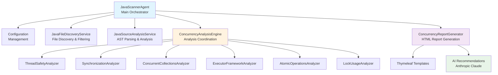
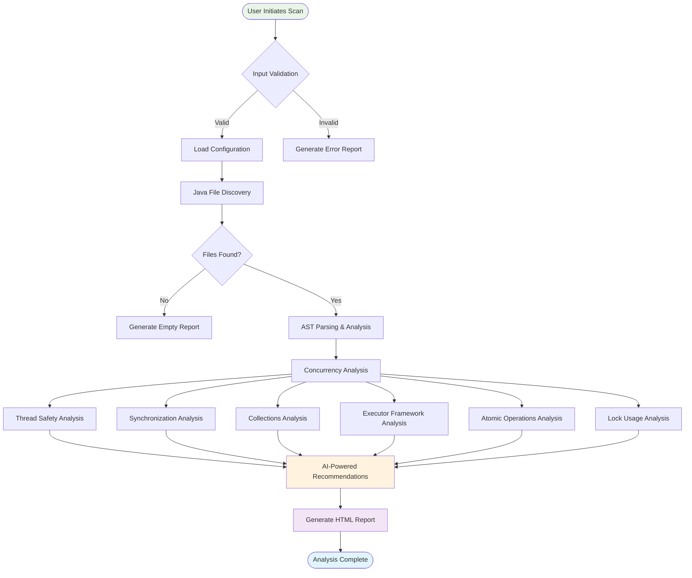
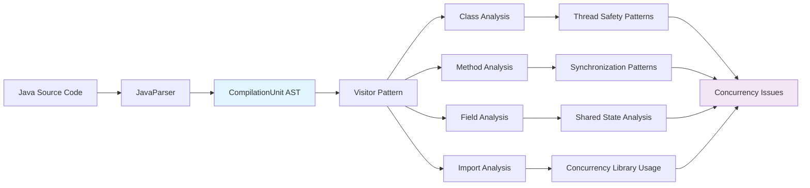
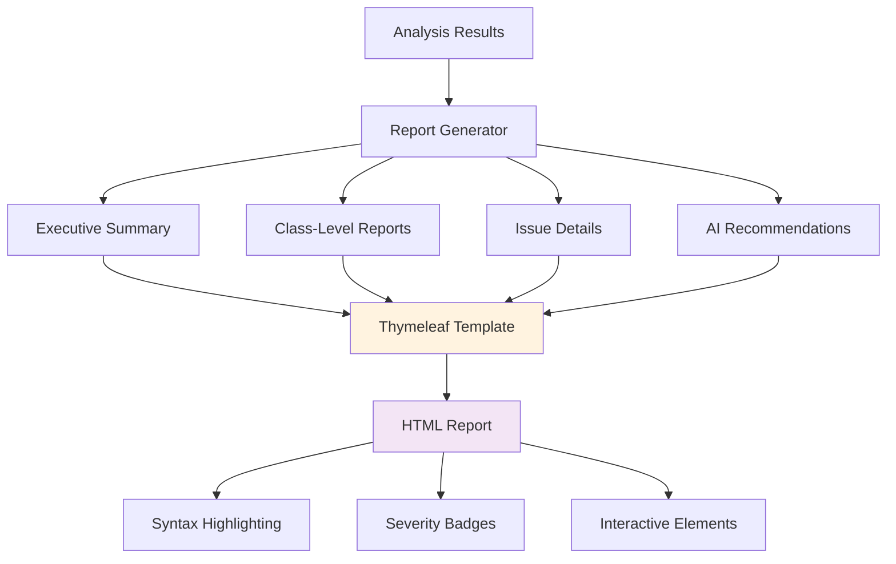

# Building an AI-Powered Java Concurrency Scanner: Architecture, Features, and Design Philosophy

*A deep dive into the design and implementation of a modern Java concurrency analysis system built with Spring AI and Anthropic Claude*

---

## Introduction: The Challenge of Java Concurrency

As a software architect, I've witnessed countless production incidents caused by subtle concurrency bugs that slip through code reviews and testing. Race conditions, deadlocks, and thread safety violations are among the most challenging issues to detect and debug in Java applications. This motivated me to design and build a comprehensive Java Concurrency Scanner that leverages AI to provide intelligent analysis and recommendations.

## System Overview

The Java Concurrency Scanner is an AI-powered static analysis tool that examines Java codebases to identify potential concurrency issues, thread safety violations, and provides actionable recommendations for improvements. Built on Spring Boot with Spring AI integration, it combines traditional AST-based analysis with modern AI capabilities to deliver comprehensive insights.

### Key Design Principles

1. **Anthropic's Efficient Agent Design**: Following Claude's best practices for agent architecture
2. **Modular Analysis**: Six specialized analyzers for different concurrency patterns
3. **AI-Enhanced Insights**: Leveraging Anthropic Claude for intelligent recommendations
4. **Developer-Friendly Reports**: Rich HTML reports with syntax highlighting
5. **Spring-Aware Filtering**: Focus analysis on business-critical Spring components

---

## Architecture Deep Dive

### 1. System Architecture Diagram



### 2. Analysis Workflow

The system follows a carefully orchestrated workflow that ensures comprehensive analysis while maintaining performance:



---

## Core Features and Motivations

### 1. **Comprehensive Concurrency Analysis**

#### Motivation
Java's concurrency model is powerful but complex. Different types of concurrency issues require specialized detection algorithms. Rather than building a monolithic analyzer, I designed six specialized analyzers, each focused on a specific aspect of concurrency.

#### Implementation
```java
@Service
public class ConcurrencyAnalysisEngine {
    @Autowired private ThreadSafetyAnalyzer threadSafetyAnalyzer;
    @Autowired private SynchronizationAnalyzer synchronizationAnalyzer;
    @Autowired private ConcurrentCollectionsAnalyzer concurrentCollectionsAnalyzer;
    @Autowired private ExecutorFrameworkAnalyzer executorFrameworkAnalyzer;
    @Autowired private AtomicOperationsAnalyzer atomicOperationsAnalyzer;
    @Autowired private LockUsageAnalyzer lockUsageAnalyzer;
    
    public List<AnalysisResult> analyzeConcurrencyIssues(List<JavaSourceInfo> sourceFiles) {
        return sourceFiles.parallelStream()
            .map(this::analyzeFile)
            .collect(Collectors.toList());
    }
}
```

#### Analysis Categories

1. **Thread Safety Issues**
   - Race conditions in shared mutable state
   - Non-atomic read-modify-write operations
   - Improper use of volatile keyword
   - Visibility problems in multi-threaded access

2. **Synchronization Problems**
   - Potential deadlock scenarios
   - Nested synchronization blocks
   - Synchronization on `this` or class objects
   - Missing synchronization for shared data

3. **Concurrent Collections Usage**
   - Non-thread-safe collections (ArrayList, HashMap)
   - Legacy synchronized collections (Vector, Hashtable)
   - Improper iteration over synchronized collections
   - Modern concurrent collections recommendations

4. **Executor Framework Patterns**
   - ExecutorService not properly shut down
   - Inappropriate thread pool sizes
   - Missing error handling in tasks
   - Resource leak detection

5. **Atomic Operations**
   - Opportunities to use atomic classes
   - Compound operations that should be atomic
   - Performance improvements with lock-free operations

6. **Lock Usage Patterns**
   - Proper ReentrantLock usage
   - ReadWriteLock optimization opportunities
   - Lock ordering to prevent deadlocks
   - Try-with-resources for automatic lock management

### 2. **Spring Annotation Filtering**

#### Motivation
In enterprise applications, not all classes require the same level of concurrency scrutiny. Business logic classes annotated with Spring stereotypes (`@Service`, `@Component`, `@Repository`) are typically more critical and likely to be accessed concurrently.

#### Implementation
```java
@Service
public class JavaSourceAnalysisService {
    private static final Set<String> SPRING_MANAGED_ANNOTATIONS = Set.of(
        "Service", "Component", "Repository", 
        "Controller", "RestController", "Configuration"
    );
    
    private boolean enableSpringFilter = false;
    
    public void setSpringFilterEnabled(boolean enabled) {
        this.enableSpringFilter = enabled;
    }
    
    private boolean shouldAnalyzeClass(ClassOrInterfaceDeclaration classDecl) {
        if (!enableSpringFilter) return true;
        
        return classDecl.getAnnotations().stream()
            .anyMatch(annotation -> 
                SPRING_MANAGED_ANNOTATIONS.contains(annotation.getNameAsString()));
    }
}
```

#### Benefits
- **Focused Analysis**: Target business-critical Spring components
- **Performance**: Faster analysis by processing fewer classes
- **Better Signal-to-Noise Ratio**: Higher quality findings in service layers

### 3. **AI-Powered Recommendations**

#### Motivation
Traditional static analysis tools identify problems but often provide generic fixes. By integrating with Anthropic Claude, the system can provide context-aware, intelligent recommendations that consider modern Java best practices.

#### Implementation
```java
@Service
public class ConcurrencyAnalysisEngine {
    @Autowired private ChatClient chatClient;
    
    private List<ConcurrencyRecommendation> generateAIRecommendations(
            AnalysisResult result) {
        if (!shouldGenerateAIRecommendations(result)) {
            return Collections.emptyList();
        }
        
        String prompt = buildAnalysisPrompt(result);
        String aiResponse = chatClient.call(prompt);
        
        return parseRecommendations(aiResponse);
    }
    
    private String buildAnalysisPrompt(AnalysisResult result) {
        return String.format("""
            Analyze the following Java concurrency issues and provide specific,
            actionable recommendations following modern Java best practices:
            
            File: %s
            Issues Found: %s
            
            Provide recommendations that are:
            1. Specific to the identified issues
            2. Follow Java concurrency best practices
            3. Consider performance implications
            4. Include code examples where helpful
            """, 
            result.getFilePath(), 
            formatIssuesForAI(result.getIssues()));
    }
}
```

### 4. **AST-Based Deep Analysis**

#### Motivation
Regular expression-based analysis is fragile and inaccurate. By using JavaParser's Abstract Syntax Tree (AST) capabilities, the system can perform precise, context-aware analysis that understands Java semantics.

#### AST Processing Flow



#### Implementation Example
```java
@Service
public class JavaSourceAnalysisService {
    private final JavaParser javaParser = new JavaParser();
    
    public JavaSourceInfo analyzeJavaFile(Path filePath) throws IOException {
        String content = Files.readString(filePath);
        ParseResult<CompilationUnit> parseResult = javaParser.parse(content);
        CompilationUnit cu = parseResult.getResult().orElse(null);
        
        JavaSourceInfo sourceInfo = new JavaSourceInfo();
        sourceInfo.setFileName(filePath.getFileName().toString());
        sourceInfo.setFilePath(filePath.toString());
        
        // Extract structural information from AST
        sourceInfo.setThreadRelatedImports(extractThreadRelatedImports(cu));
        sourceInfo.setClasses(extractClassInfo(cu));
        
        return sourceInfo;
    }
    
    private List<ClassInfo> extractClassInfo(CompilationUnit cu) {
        return cu.findAll(ClassOrInterfaceDeclaration.class).stream()
            .filter(classDecl -> !classDecl.isInterface())
            .map(this::createClassInfo)
            .collect(Collectors.toList());
    }
}
```

### 5. **Rich HTML Report Generation**

#### Motivation
Developers need actionable, visually appealing reports that make it easy to understand and prioritize concurrency issues. The system generates comprehensive HTML reports with syntax highlighting, severity indicators, and AI recommendations.

#### Report Architecture


#### Template Structure
```html
<!-- Executive Summary Section -->
<div class="summary">
    <h2>Executive Summary</h2>
    <div class="stats-grid">
        <div class="stat-card">
            <div class="stat-value" th:text="${summary.totalFiles}">0</div>
            <div class="stat-label">Java Files Analyzed</div>
        </div>
        <div class="stat-card">
            <div class="stat-value" th:text="${summary.totalIssues}">0</div>
            <div class="stat-label">Concurrency Issues</div>
        </div>
        <!-- More statistics... -->
    </div>
</div>

<!-- Issue Details with Syntax Highlighting -->
<div class="section">
    <h2>Concurrency Issues Found</h2>
    <div th:each="issue : ${allIssues}">
        <div class="issue-card" th:classappend="${issue.severity.name().toLowerCase()}">
            <div class="issue-header">
                <span class="issue-type" th:text="${issue.type}">ISSUE_TYPE</span>
                <span class="severity-badge" 
                      th:classappend="'severity-' + ${issue.severity.name().toLowerCase()}"
                      th:text="${issue.severity}">SEVERITY</span>
            </div>
            <p><strong>Class:</strong> <span th:text="${issue.className}">ClassName</span></p>
            <p><strong>Line:</strong> <span th:text="${issue.lineNumber}">0</span></p>
            <p th:text="${issue.description}">Issue description</p>
            
            <div th:if="${issue.codeSnippet}" class="code-snippet">
                <pre th:text="${issue.codeSnippet}">Code snippet</pre>
            </div>
            
            <div th:if="${issue.suggestedFix}">
                <strong>Suggested Fix:</strong>
                <p th:text="${issue.suggestedFix}">Fix suggestion</p>
            </div>
        </div>
    </div>
</div>
```

---

## Technical Implementation Details

### 1. **Configuration Management**

The system uses a flexible YAML-based configuration system that allows fine-tuning of analysis parameters:

```yaml
scanner:
  analysis:
    max-file-size-mb: 10
    max-files: 1000
    include-patterns:
      - "**/*.java"
    exclude-patterns:
      - "**/target/**"
      - "**/build/**"
      - "**/*Test.java"
  
  # Spring annotation filtering
  spring-filter:
    enabled: false
    annotations:
      - "Service"
      - "Component"
      - "Repository"
      - "Controller"
      - "RestController"
      - "Configuration"
  
  rules:
    thread-safety:
      check-static-fields: true
      check-instance-fields: true
      detect-race-conditions: true
    
    synchronization:
      detect-deadlocks: true
      check-nested-sync: true
      warn-sync-on-this: true
```

### 2. **Spring AI Integration**

The system leverages Spring AI for seamless integration with Anthropic Claude:

```yaml
spring:
  ai:
    anthropic:
      api-key: ${ANTHROPIC_API_KEY}
      chat:
        options:
          model: claude-3-sonnet-20240229
          temperature: 0.3
          max-tokens: 1000
```

### 3. **Error Handling and Resilience**

The system implements comprehensive error handling following Anthropic's agent design principles:

```java
@Component
public class JavaScannerAgent {
    
    public void executeConcurrencyAnalysis(String scanPath, String outputPath, String configPath) {
        logger.info("Starting Java concurrency analysis for path: {}", scanPath);
        
        try {
            // Input Validation
            if (!validateInputs(scanPath, outputPath, configPath)) {
                return;
            }
            
            // Load Configuration
            configuration.loadConfiguration(configPath);
            
            // Execute analysis workflow...
            
        } catch (Exception e) {
            logger.error("Critical error during concurrency analysis", e);
            handleCriticalError(e, outputPath);
        }
    }
    
    private void handleCriticalError(Exception error, String outputPath) {
        try {
            reportGenerator.generateErrorReport(error, outputPath);
            logger.info("Generated error report at: {}", outputPath);
        } catch (Exception e) {
            logger.error("Failed to generate error report", e);
        }
    }
}
```

---

## Performance Considerations

### 1. **Parallel Processing**

The system uses Java's parallel streams for concurrent analysis of multiple files:

```java
public List<AnalysisResult> analyzeConcurrencyIssues(List<JavaSourceInfo> sourceFiles) {
    return sourceFiles.parallelStream()
        .map(this::analyzeFile)
        .collect(Collectors.toList());
}
```

### 2. **Memory Management**

- Configurable file size limits to prevent memory exhaustion
- Stream-based processing for large codebases
- Efficient AST traversal using visitor patterns

### 3. **Scalability Features**

- Configurable thread pool sizes
- Optional exclusion of test files and generated code
- Incremental analysis capabilities

---

## Testing Strategy

The system includes comprehensive testing across multiple dimensions:

### 1. **Unit Testing with Spock**
```groovy
class JavaScannerAgentSpec extends Specification {
    
    def "should execute complete concurrency analysis workflow successfully"() {
        given: "valid input parameters"
        def scanPath = tempDir.toString()
        def outputPath = tempDir.resolve("report.html").toString()
        def configPath = "config.yaml"

        when: "executing concurrency analysis"
        agent.executeConcurrencyAnalysis(scanPath, outputPath, configPath)

        then: "should execute all workflow steps in order"
        1 * mockConfiguration.loadConfiguration(configPath)
        1 * mockFileDiscoveryService.discoverJavaFiles(_) >> javaFiles
        1 * mockSourceAnalysisService.analyzeJavaFiles(javaFiles) >> sourceInfos
        1 * mockAnalysisEngine.analyzeConcurrencyIssues(sourceInfos) >> analysisResults
        1 * mockReportGenerator.generateHtmlReport(analysisResults, outputPath)
    }
}
```

### 2. **Integration Testing**
- End-to-end workflow testing with sample problematic Java files
- AI recommendation validation
- Report generation verification

### 3. **Sample Test Files**
The system includes carefully crafted test files that demonstrate various concurrency issues:

```java
// ConcurrencyIssuesExample.java
public class ConcurrencyIssuesExample {
    // Issue 1: Non-thread-safe shared mutable state
    private static int sharedCounter = 0;
    private List<String> unsafeList = new ArrayList<>();
    
    // Issue 2: Race condition
    public void incrementCounter() {
        sharedCounter++; // Race condition: read-modify-write not atomic
    }
    
    // Issue 3: Potential deadlock scenario
    private final Object lock1 = new Object();
    private final Object lock2 = new Object();
    
    public void methodA() {
        synchronized (lock1) {
            synchronized (lock2) { /* ... */ }
        }
    }
    
    public void methodB() {
        synchronized (lock2) {
            synchronized (lock1) { /* ... */ }
        }
    }
}
```

---

## Usage Examples

### 1. **Command Line Usage**
```bash
# Basic analysis
java -jar scanner.jar --scan-path ./src --output ./report.html

# With custom configuration
java -jar scanner.jar --scan-path ./src --output ./report.html --config ./scanner_config.yaml

# Spring Boot runner
mvn spring-boot:run -Dspring-boot.run.arguments="./test-samples"
```

### 2. **Spring Integration**
```java
@Component
public class ConcurrencyAuditService {
    
    @Autowired
    private JavaScannerAgent scannerAgent;
    
    public AnalysisResult auditProject(String projectPath) {
        return scannerAgent.analyzeJavaCode(projectPath);
    }
}
```

---

## Future Enhancements

### 1. **Planned Features**
- **IDE Integration**: VS Code and IntelliJ IDEA plugins
- **CI/CD Integration**: GitHub Actions and Jenkins pipeline support
- **Custom Rules Engine**: User-defined concurrency patterns
- **Performance Profiling**: Integration with JProfiler metrics
- **Machine Learning**: Pattern recognition for custom concurrent code styles

### 2. **Scalability Improvements**
- **Distributed Analysis**: Support for multi-node processing
- **Incremental Scans**: Only analyze changed files
- **Database Integration**: Store historical analysis results
- **API Service**: REST API for programmatic access

---

## Lessons Learned

### 1. **Architecture Decisions**

**Modular Analyzer Design**: Separating analyzers by concern made the system more maintainable and testable. Each analyzer can be developed, tested, and deployed independently.

**AST vs. Regex**: The decision to use JavaParser's AST was crucial for accuracy. Early prototypes using regex patterns had too many false positives.

**AI Integration Timing**: Adding AI recommendations as a post-processing step rather than inline with analysis improved performance and made the system more resilient to AI service disruptions.

### 2. **Performance Optimizations**

**Parallel Processing**: Using parallel streams improved analysis speed by 3-4x on multi-core systems.

**Memory Management**: Implementing configurable file size limits prevented OutOfMemoryErrors on large codebases.

**Template Caching**: Caching Thymeleaf templates significantly improved report generation speed.

### 3. **User Experience Insights**

**Visual Report Design**: Developers strongly preferred visual severity indicators and syntax highlighting over plain text reports.

**Spring Filter Feature**: The ability to focus on Spring-managed components was highly valued by enterprise teams.

**AI Recommendation Quality**: Context-aware AI recommendations were significantly more valuable than generic suggestions.

---

## Conclusion

Building the Java Concurrency Scanner has been an exciting journey that combines traditional static analysis techniques with modern AI capabilities. The system demonstrates how thoughtful architecture, combined with powerful tools like Spring AI and Anthropic Claude, can create developer tools that are both technically sophisticated and practically useful.

The modular design ensures maintainability and extensibility, while the AI integration provides intelligent insights that go beyond traditional static analysis. The rich HTML reports make complex concurrency issues accessible to developers at all levels.

As Java applications continue to evolve and concurrency becomes increasingly important for performance, tools like this scanner become essential for maintaining code quality and preventing production issues.

### Key Takeaways

1. **Modular architecture** enables focused, testable components
2. **AST-based analysis** provides accuracy that regex cannot match
3. **AI integration** transforms static analysis from detection to guidance
4. **Developer experience** matters as much as technical capability
5. **Comprehensive testing** with realistic examples ensures reliability

The Java Concurrency Scanner represents a new generation of development tools that leverage AI to make complex software engineering challenges more manageable. By combining deep technical analysis with intelligent recommendations, it empowers developers to write safer, more reliable concurrent code.

---

*For more details about the implementation, visit the [project repository](https://github.com/your-repo/java-concurrency-scanner) or try the scanner on your own Java projects.*

**Technologies Used:**
- Java 17+
- Spring Boot 3.2+
- Spring AI 0.8.1
- Anthropic Claude
- JavaParser
- Thymeleaf
- Spock Testing Framework

**Author:** Software Architect & Java Concurrency Specialist
**Date:** December 2024
